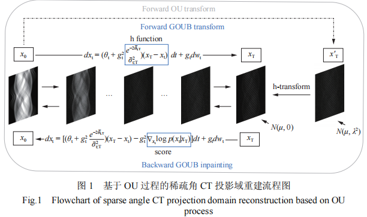
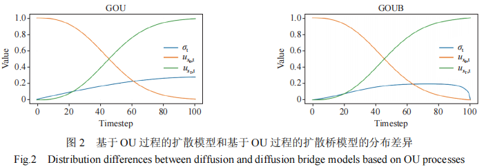
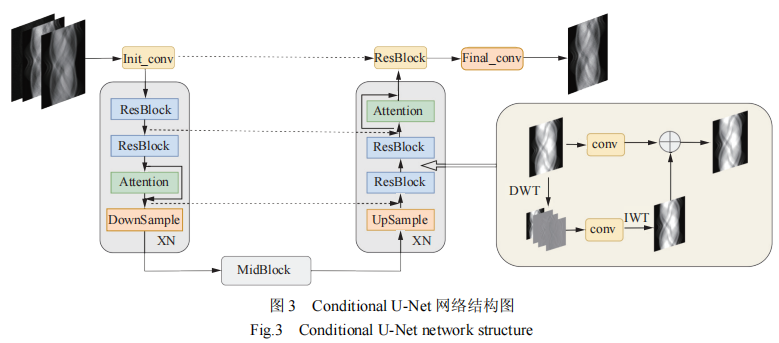
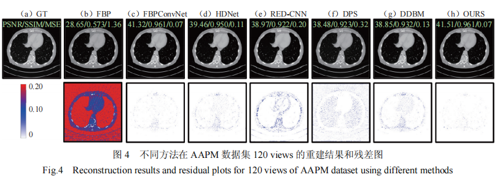
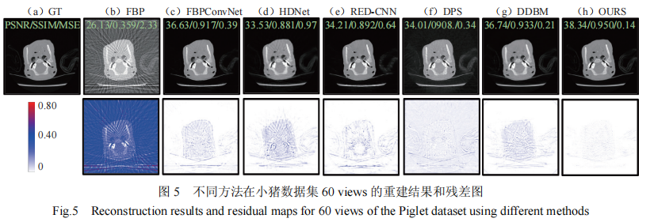
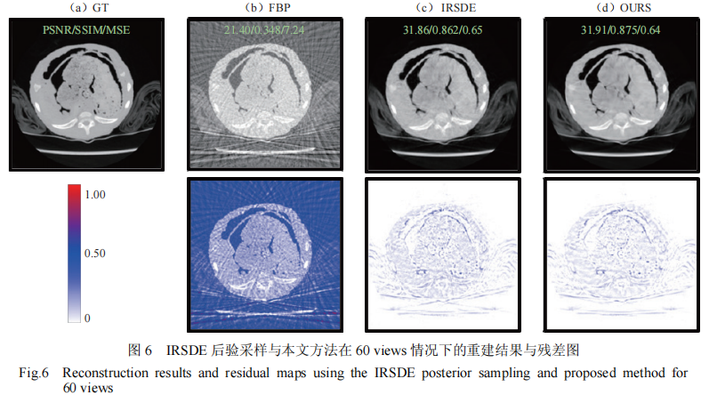
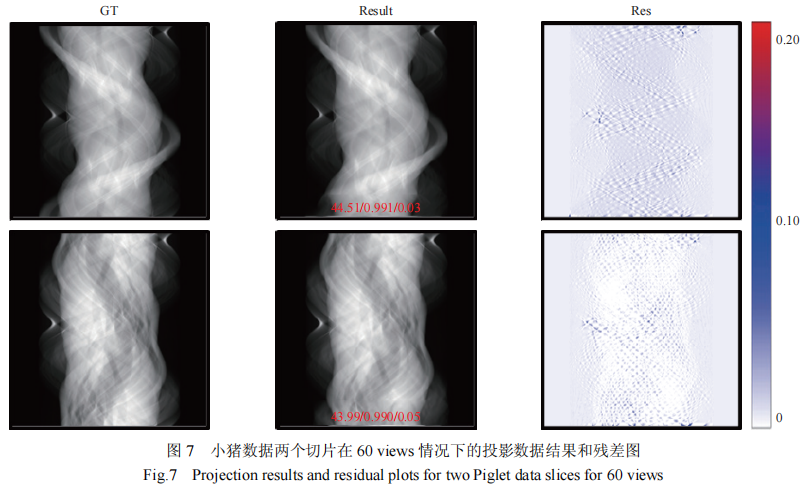

# Mean-Reverting Diffusion Bridge with Projection Prior for Sparse CT Reconstruction

This repository contains the PyTorch implementation of the paper **"Mean-Reverting Diffusion Bridge with Projection Prior for Sparse CT Reconstruction"** .

## Abstract
In sparse-view computed tomography (CT),incomplete proiection data often lead to artifacts, edge blurring and structuraldistortions in the reconstructed images. 'To address this challenge, this Study proposes a diffusion bridge model based on theOmstein-Uhlenbeck (OU) process for the conditional completion of missing prgjection-domain data 1o enable high-quality sparse-view reconstruction.The proposed method leverages the mean-reverting property of the OU process 1o establish a physically consistentstochastic diffusion mechanism. The difliusion bridge constraint anchors the sampling trajectory between the reconstruction prior andsparse proiections.,thereby achieving high-fidelity restoration of the missing data Furtherore,a multiscale feature fiusion module inthe wavelet domain is incorporated into the network architecture 1o cffectively integrate Iow-frequency structural information with high-requency texture details, thereby enhaneing the capability of the model 1o recover fne image features. Expermental resultsdemonstrate that under the same sparse view conditions, the proposed method outperfors existing state-of-the-art approaches in tersof both visual quality and quantitative metrics, confimming its effectiveness for sparse-view CT reconstruction tasks.

Keywords: computed tomography; diffusion bridge model; sinogram prior; discrete wavelet transform

## Key Features
* **Mean-Reverting Diffusion Bridge:** Utilizes the Generalized Ornstein-Uhlenbeck (OU) process to model the transition between clean data and prior data, rather than traversing to pure noise.
* **Projection Prior Guidance:** Leverages the rough reconstruction (e.g., FBP of sparse views) as the terminal distribution of the forward process, preserving low-frequency structural information.
* **Manifold Constraint:** Incorporates a data-consistency step during sampling to project the intermediate results back onto the measurement subspace, reducing hallucinations.
* **High Fidelity:** Outperforms traditional methods (FBP, TV) and standard deep learning models (RED-CNN, DDPM) in preserving texture and suppressing streak artifacts.

## Method Overview

  
   

  
   

  
   

## Results

  
   

  
   

  
   

  
   

## Citation
If you use this code or find our work useful, please cite:
@article{li2025,
  title={Mean-Reverting Diffusion Bridge with Projection Prior for Sparse CT Reconstruction},
  author={Li, Yan and Shi, Liu and Liu, Qiegen},
  journal={Computerized Tomography Theory and Applications},
  volume={34},
  number={3},
  pages={356},
  year={2025},
  doi={10.15953/j.ctta.2025.356}
}
